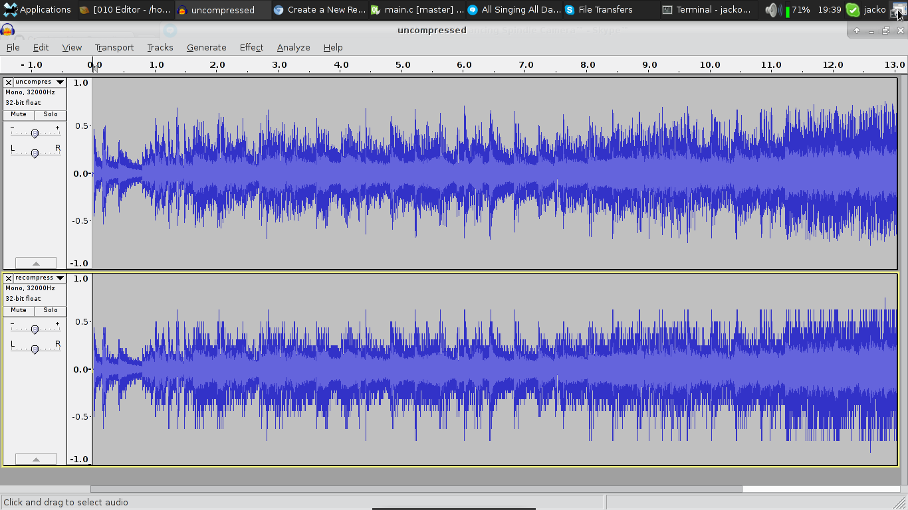

# Nintendo DSP-ADPCM Encoder Tool

This is a free reimplementation of Nintendo's DSPADPCM encoder tool
for generating GC-DSPADPCM data targeting GameCube, Wii and Wii U
systems.

This project is currently in its infancy and doesn't encode the best
sounding audio ATM.

### ^ Quantization artifacts up the wazoo!!
